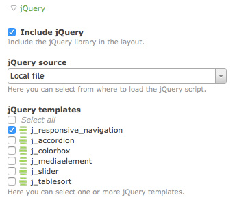

Responsive Navigation Extension for Contao
==========================================

The Responsive Navigation extends Contaos responsive design by switching the
navigation menu into a mobile menu design with expandable menu items on small
displays.

*   Using only CSS and JavaScript/jQuery.
*   No extra module in layout necessary.
*   No duplicate menu in HTML code.
*   Full designable.

Usage
-----

1.  Enable jQuery and add _j_responsive_navigation_ template to your layout.
2.  Set CSS id `mainmenu` to your navigation module.
3.  Style your responsive mobile menu.

Theme
-----

The following code shows a snippet of a menu.

    <nav class="mod_navigation block" id="mainmenu">
        
&#9776;

        <a href="#skipNavigation109" class="invisible">Skip navigation</a>
        <ul class="level_1" role="menubar">
            <li>[...]</li>
        </ul>
        <a id="skipNavigation109" class="invisible">&nbsp;</a>
    </nav>

The supplied CSS hides the mobile menu icon `#mainmenu-icon` on desktop and hide
the menu `#mainmenu > ul` on mobile devices. The supplied JavaScript toggle the
menu `#mainmenu > ul` on mobile devices.
